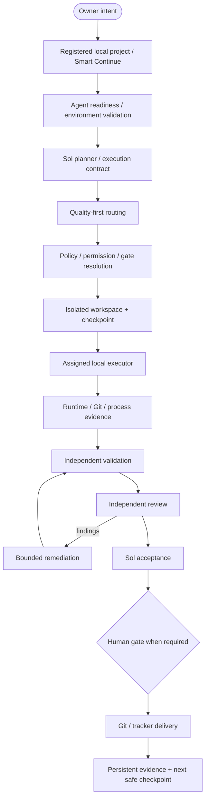
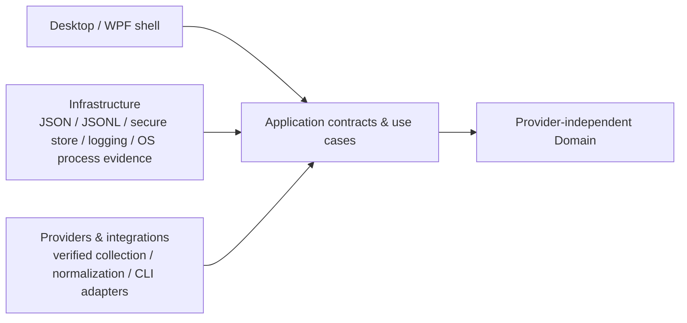

<p align="center">
  
</p>

<h1 align="center">AI_Orchestrator</h1>

<p align="center">
  Intelligent orchestration for projects, AI agents, execution, and quality.
</p>

<p align="center">
  <a href="https://dotnet.microsoft.com/"></a>
  <a href="https://learn.microsoft.com/dotnet/desktop/wpf/"></a>
  <a href="https://www.microsoft.com/windows/"></a>
  <a href="https://learn.microsoft.com/dotnet/csharp/"></a>
</p>

<p align="center">
  
</p>

> APO is a local-first Windows control center for supervising AI-assisted software delivery. It is being built to coordinate the planner, executor, reviewer, Git/GitHub/Azure Repos, Jira/Azure Boards, validation/CI, and owner approval in one place—without replacing the IDE or those platforms.

## Current V1 status

The accepted FAST V1 foundation through APO-48, APO-51, APO-49, APO-63, APO-50, and APO-33 remains
preserved. GitHub Actions CI is active on `main`, and v1.0.0 has **not** been released.

The sole active implementation/recovery gate is **APO-70 (GitHub issue #111)** on
`feature/APO-70-v1-desktop-product-recovery`, with Draft PR #112. The recovery line has already
proved a real production-composed Sol `PrepareAsync` path through contract, WorkGraph, routing,
Luna selection, handoff, isolated workspace preparation, recovery checkpoint, and `Ready`. Persisted
`Ready` was rehydrated across coordinator/process restart, followed by exactly one real
`gpt-5.6-luna` `StartAsync` workspace-write execution and a passing fresh-process anti-replay
check. The backend cross-process proof is **SOL-ACCEPTED / COMPLETE** on source head
`a2719257e6dc2b276152f35aa34ad945a912a20a` for ProjectId `c743e0da-24a6-4ad3-b309-aeb72658013c`.
The remaining gate is fresh owner-visible Desktop functional + visual acceptance, followed by final
exact-head Sol acceptance; merge, release, and deployment remain pending.

The external-reference reviews have now been integrated as **planning/governance only**. They did
not replace APO's stack or execution architecture. See
[`docs/EXTERNAL_REFERENCE_ROADMAP_INTEGRATION.md`](docs/EXTERNAL_REFERENCE_ROADMAP_INTEGRATION.md)
and [`.ai/CURRENT_STATE_ADDENDUM_2026-09-17.md`](.ai/CURRENT_STATE_ADDENDUM_2026-09-17.md), plus
[`docs/GITHUB_ECOSYSTEM_ROADMAP_EXTENSION_2026-09-17.md`](docs/GITHUB_ECOSYSTEM_ROADMAP_EXTENSION_2026-09-17.md).

V1 execution is focused on OpenAI and Claude under the canonical routing policy. Antigravity remains
auxiliary bounded capacity where separately approved. `COPILOT = POST-V1`, and new
provider-specific expansion is deferred unless it is required for release safety.

## What is AI_Orchestrator?

AI_Orchestrator (APO) coordinates the work around software delivery: projects and
repositories, AI capacity, model and agent access, planner-authored execution contracts, bounded
execution, validation, independent review, acceptance, and audit history. The intended experience
lets the owner supervise the handoff between the planner, the bounded executor, the independent
reviewer, source control, work tracking, validation/CI, and the final approval gate.

The product is not an AI chat application and does not replace an IDE, GitHub, Jira, or Azure
DevOps. Its job is to reduce fragile copy/paste handoffs while keeping the owner in charge of
high-risk actions. Quality and risk come before quota savings, and unavailable provider data stays
explicitly unavailable or manual.

## Core capabilities

The product direction brings these capabilities into one supervised workflow:

- :brain: Intelligent, quality-first model and agent routing with quota awareness.
- :bar_chart: AI capacity, subscription, quota, credit, and reset monitoring.
- :file_folder: Project awareness with isolated local workspaces and repository state.
- :robot: AI agent and model registry with truthful connection capabilities and future readiness evidence.
- :compass: Planner-authored work classification and execution contracts.
- :gear: Bounded, cancellable execution with explicit budgets and stop conditions.
- :repeat: Recoverable execution with authoritative checkpoints and future failure-classified retry/fallback.
- :test_tube: Validation evidence captured independently from executor claims.
- :mag: Independent review and bounded remediation at configured checkpoints.
- :shield: Human approval gates for high-risk decisions and delivery actions.
- :page_facing_up: Local activity, audit, history, notifications, and reconstructable state.
- :desktop_computer: Local-PC-first execution with durable project/workspace/evidence state.
- :bar_chart: Future controlled multi-model benchmarking in isolated workspaces.

These are the approved product capabilities, not a claim that every adapter or runtime is already
implemented. See [Current implementation status](#current-implementation-status).

## Orchestration flow

The target product flow is:



The retry/fallback direction is intentionally policy-driven rather than a hard-coded provider chain:

```text
Typed failure
  + latest verified checkpoint
  + observed side effects
  + task/capability requirements
  + routing and owner policy
  + current readiness/capacity truth
  + remaining budget
      ↓
Retry same executor / eligible fallback / wait / reconcile / remediate / owner gate / stop
```

## Current implementation status

APO is an active foundation, not a finished orchestration product.

| Status | Current evidence |
| --- | --- |
| :white_check_mark: Implemented / validated | .NET 10 WPF foundation and resilient empty/no-provider startup shell |
| :white_check_mark: Implemented / validated | JSON documents and monthly JSONL local persistence with safe-write and recovery behavior |
| :white_check_mark: Implemented / validated | Provider-independent quota, subscription, usage, alert, and refresh contracts |
| :white_check_mark: Implemented / validated | Windows Credential Manager adapter with opaque credential references and focused security tests |
| :white_check_mark: Implemented / validated | Self-contained multi-RID publish configuration for `win-x64`, `win-x86`, and `win-arm64` |
| :white_check_mark: Implemented / validated | Project and orchestration storage foundation with stores/contracts for projects, agents, routing, runs, checkpoints, evidence, review, and audit state |
| :white_check_mark: Implemented / validated | Projects workspace and durable project registry with truthful local persistence states |
| :white_check_mark: Implemented / validated | APO-37 read-only local Git repository verification with bounded status evidence, cancellation/project isolation, sanitized remotes, and explicit unavailable states |
| :white_check_mark: Implemented / validated | APO-38..43 control-plane contracts/services: agent/model truth, progressive onboarding, versioned contracts, dependency-aware WorkGraphs, structured handoffs, and durable Smart Continue/recovery state |
| :white_check_mark: Implemented / validated | APO-44..46 bounded execution foundation: explainable quality-first routing, isolated workspaces, and bounded cancellable execution with project/authority/recovery safeguards |
| :white_check_mark: Implemented / validated | APO-68 workspace-preparation hardening: fail-closed approval-index recovery, mutation timeout safety, repository lock identity, and inherited Git-environment hardening |
| :warning: Partial / validated | APO-70 backend cross-process proof is Sol-accepted and complete; fresh owner-visible Desktop functional + visual acceptance remains pending |
| :white_check_mark: Implemented / validated | APO-47 tracker-agnostic work-item/dependency synchronization foundation with bounded reads, explicit mutation authority, post-verification, and audit evidence |
| :white_check_mark: Implemented / validated | Official provider capacity adapter surfaces for Codex, Claude, Kimi, GitHub Copilot, and Antigravity, with documented manual/unsupported boundaries |
| :white_check_mark: Implemented / validated | APO-62 provider-independent, read-only remote SCM and CI evidence (GitHub and Azure Repos) |
| :white_check_mark: Delivered / accepted | APO-48 independent validation evidence and evidence-based QA gates |
| :white_check_mark: Delivered / accepted | APO-51 Review Inbox and bounded remediation loop |
| :white_check_mark: Delivered / accepted | APO-49 human approval policy and gates |
| :white_check_mark: Delivered / accepted | APO-63 controlled remote source-control delivery with explicit gates and exact-target evidence |
| :white_check_mark: Delivered / accepted | APO-33 repository-owned GitHub Actions CI and multi-RID packaging |
| :compass: Active roadmap | APO-55 → APO-71 → APO-75 → APO-72 → APO-52/APO-54 → APO-76 → APO-77 → APO-73 → APO-74 → APO-78 |

The source/runtime validation baseline immediately before the 2026-09-16 planning-only roadmap
commits was feature SHA `14d8d470d63c17e726278cb0336e737b4fdc5022`, PR CI run
`34987372556`, **1,406 passed / 0 failed / 0 skipped**, Release build **0 warnings / 0 errors**, and
successful self-contained publish validation for `win-x86`, `win-x64`, and `win-arm64`. Later
planning/documentation commits move the branch HEAD and must not reuse that older SHA as an
exact-head runtime acceptance claim.

Not yet proven/accepted: the complete owner-visible end-to-end lifecycle, owner visual/functional
acceptance, final APO-70 exact-head acceptance, and release readiness. Claude execution remains a
separate provider/runtime capability and must not be claimed from the Codex proof.

## Smart Continue and integration boundaries

The Smart Continue contract and durable recovery state are implemented by APO-43 and have been
extended by the APO-70 persisted-Ready recovery work. The owner-facing command-center experience is
not yet final. Recovery resolves project/run context, contract version, dependency state, selected
roles, repository/tracker evidence, validation, review, approval, blockers, and next safe action
from project-isolated state rather than treating old chat history as current evidence.

The roadmap keeps source-control responsibilities distinct:

- **Local Git — APO-37:** implemented read-only verification of a configured local repository and
  its bounded worktree evidence. It performs no remote request and no Git write.
- **Remote SCM evidence — APO-62:** delivered provider-independent, read-only evidence from official
  GitHub and Azure Repos integration paths for repository identity, branches/commits, pull requests,
  reviews, checks, and CI/workflow state where exposed.
- **Controlled delivery — APO-63:** separately gated remote write operations bound to exact
  immutable targets, current validation evidence, applicable approval policy, and audit identity.

A model CLI, missing remote evidence, or a local branch state must not be presented as proof of
remote health, CI success, synchronization, or delivery completion.

## Local-PC-first execution and recovery

APO's normal software-delivery execution target is the owner's persistent Windows PC:

```text
APO Desktop
    │
    ├── persistent LocalAppData configuration/state
    ├── durable registered local projects
    ├── real local Git repositories
    ├── APO-managed isolated workspaces
    ├── local authenticated AI CLIs where supported
    ├── local Git / SDKs / compilers / test runners / browsers / tools
    └── durable checkpoint, execution, validation, review, and audit evidence
```

Temporary provider output folders, test harnesses, or chat sandboxes are implementation/testing
details and are never the canonical project state. A future remote/sandbox execution target, if
approved, remains optional and separately governed.

The reference-derived local durability roadmap adds process/PID evidence and restart reconciliation
to APO-55, executable provenance/version/readiness to APO-71, and failure-classified retry/fallback
to APO-72. Installation, authentication, entitlement/subscription, and capacity remain separate
facts.

## WPF shell preview

The first branded shell is intentionally a foundation surface: it shows the product identity,
local-first state, and truthful future boundaries without inventing provider data or dashboard
metrics.

<p align="center">
  
</p>

## Architecture

The active architecture is a portable C#/.NET 10 WPF application with clean dependency direction,
JSON/JSONL local persistence, and secure external credential storage. No database engine, ORM,
Node.js runtime, embedded browser, or APO-owned cloud backend is required by V1.



The technical solution and namespaces still use the compatibility-sensitive `AIUsageMonitor` name.
That is deliberate: the product identity has changed, but a large technical rename and LocalAppData
migration require their own planner-approved work.

The external-reference work does **not** introduce another runner, registry, router, state machine,
workspace system, or persistence layer. New features must extend existing APO authorities.

## AI operating model

APO follows a quality- and risk-first operating policy. Capacity can inform routing, but it never
overrides capability, risk, or the required review gate.

| Model | Default role |
| --- | --- |
| **GPT-5.6 Sol High** | Planner, architect, router, quota governor, acceptance and prompt authority (chat only) |
| **GPT-5.6 Luna xHigh** | Primary bounded implementation executor |
| **Claude Sonnet 5 Medium** | Fallback / special-need bounded implementation when explicitly selected by Sol |
| **Claude Sonnet 5 High** | Fallback / special-need difficult bounded implementation when explicitly selected by Sol |
| **GPT-5.6 Luna Max** | Exceptional implementation escalation only |
| **Claude Opus 5** | Independent critical reviewer at meaningful checkpoints |
| **GPT-5.6 Terra Medium/High** | Specialist security, concurrency, and data-integrity assurance |
| **Claude Haiku 4.5** | Disabled from active routing |

OpenAI/Codex and Anthropic/Claude are the active execution providers. GPT-5.6 Sol remains the
planner, architect, router, quota governor, acceptance authority, and prompt authority in chat mode.
Luna xHigh is the normal primary executor. Sonnet is an explicit fallback/special-need option;
Haiku is disabled from active routing; Opus remains independent; and Terra is risk-triggered. The
canonical policy is maintained in
[AI model routing](.ai/AI_MODEL_ROUTING.md) and [AI execution policy](.ai/AI_EXECUTION_POLICY.md).

Future APO-74 historical-performance routing is advisory and transparent: it may affect selection
only among already eligible candidates and cannot override correctness, security, capability,
project/owner policy, authentication/entitlement, or required gates.

## Security and privacy

- :lock: Windows Credential Manager stores actual credentials outside JSON, JSONL, logs, and source control.
- :key: Application state stores only opaque credential references; raw tokens and passwords are not persisted.
- :no_entry_sign: APO does not extract browser cookies, scrape passwords, or treat a consumer subscription as API entitlement.
- :package: Local-first project state and history remain under per-user application data.
- :scroll: Evidence and audit history explain routing, validation, review, recovery, and approval decisions without requiring private chain-of-thought.
- :shield: High-risk operations stop at explicit human approval gates.
- :closed_lock_with_key: Broad provider permission bypasses and generic shell-interpolated runners are not part of APO's execution architecture.

Project isolation, configured exclusions, secret scanning/redaction, least privilege, and visible
destinations are part of the product contract for future integrations. Environment fingerprints
use a documented non-secret allowlist, never unrestricted process environments.

## Windows compatibility

APO targets Windows 10 version 1809 (build 17763) and Windows 11, with these release RIDs under
consideration:

- `win-x64` - primary development and validation target.
- `win-x86` - configured and compile/publish validated where stated in the evidence.
- `win-arm64` - configured and compile/publish validated where stated; ARM64 hardware execution is not claimed.

The consumer goal is a self-contained Windows application that does not require a separately
installed .NET runtime, SDK, Visual Studio, database engine, Node/npm, embedded browser, or provider
CLI. Claims are limited to the environments and commands actually run.

## Repository structure

```text
AI_Orchestrator/
|-- assets/
|   |-- Logo.png
|   |-- Colors.png
|   |-- runtime/apo-icon.ico
|   `-- readme/apo-flow.svg
|-- docs/
|   |-- BRD.md
|   |-- IMPLEMENTATION_PLAN.md
|   |-- STRATEGIC_ROADMAP.md
|   |-- EXTERNAL_REFERENCE_ROADMAP_INTEGRATION.md
|   |-- LEGACY_IMPLEMENTATION_MAP.md
|   |-- SESSION_PROMPTS.md
|   |-- APO-31_PROVIDER_EVIDENCE.md
|   `-- evidence/ (retained acceptance screenshots)
|-- scripts/Validate-PublishOutput.ps1
|-- .github/workflows/ci.yml
|-- src/
|   |-- AIUsageMonitor.Desktop/
|   |-- AIUsageMonitor.Application/
|   |-- AIUsageMonitor.Domain/
|   |-- AIUsageMonitor.Infrastructure/
|   `-- AIUsageMonitor.Providers/
|-- tests/
|-- .ai/AI_EXECUTION_POLICY.md
|-- .ai/AI_MODEL_ROUTING.md
|-- .ai/CURRENT_STATE.md
|-- .ai/CURRENT_STATE_ADDENDUM_2026-09-16.md
|-- AGENTS.md
|-- CLAUDE.md
|-- TASK.md
|-- Directory.Build.props
`-- AIUsageMonitor.sln
```

## Build and test

The commands below use the compatibility-preserved solution name:

```powershell
dotnet restore AIUsageMonitor.sln
dotnet build AIUsageMonitor.sln
dotnet test AIUsageMonitor.sln
```

The desktop test project builds for the `x64` platform. Running it on its own, rather than through
the solution, needs that platform stated explicitly or the run may execute a stale `AnyCPU`
assembly:

```powershell
dotnet test tests/AIUsageMonitor.Desktop.Tests/AIUsageMonitor.Desktop.Tests.csproj `
  -p:Platform=x64
```

For a self-contained Windows artifact, use one of the desktop publish profiles:

```powershell
dotnet publish src/AIUsageMonitor.Desktop/AIUsageMonitor.Desktop.csproj `
  -p:PublishProfile=win-x64
```

For an owner-visible local run, use the canonical fresh-run script:

```powershell
.\scripts\Run-FreshDesktop.ps1
```

The script recreates `artifacts/local-run/win-x64`, publishes a fresh Release build from the
current working tree, validates that output, then launches only its executable. Use the
runtime/stop semantics defined in `AGENTS.md` and `.ai/AI_EXECUTION_POLICY.md`; `-SmokeTest`
provides bounded startup validation and cleanup. Existing binaries from prior publish/artifact
directories are not current-run evidence.

### Continuous integration

GitHub Actions runs on pull requests targeting `main`, pushes to `main`, and manual dispatches.
The `AI_Orchestrator CI` workflow restores and builds the solution in Release, runs the canonical
test suite with TRX results, and publishes independently validated artifacts for every runtime
identifier declared by the desktop project: `win-x86`, `win-x64`, and `win-arm64`.

Historical accepted `main` evidence remains tied to the exact SHAs/runs recorded in the relevant
Issues/current-state history. Unmerged APO-70 evidence is similarly exact-SHA scoped; do not carry
an older test count forward as proof for a newer documentation or source head.

## Documentation

- [Business Requirements Document](docs/BRD.md)
- [Implementation Plan](docs/IMPLEMENTATION_PLAN.md)
- [Strategic Orchestration Roadmap](docs/STRATEGIC_ROADMAP.md)
- [External Reference Roadmap Integration](docs/EXTERNAL_REFERENCE_ROADMAP_INTEGRATION.md)
- [Legacy Implementation Map](docs/LEGACY_IMPLEMENTATION_MAP.md)
- [Session Prompt Library](docs/SESSION_PROMPTS.md)
- [Universal Execution Contract](AGENTS.md)
- [Canonical AI Execution Policy](.ai/AI_EXECUTION_POLICY.md)
- [Canonical AI Model Routing Policy](.ai/AI_MODEL_ROUTING.md)
- [Current State and Validation Handoff](.ai/CURRENT_STATE.md)
- [Current-State Addendum — 2026-09-16](.ai/CURRENT_STATE_ADDENDUM_2026-09-16.md)
- [Current-State Addendum — 2026-09-17](.ai/CURRENT_STATE_ADDENDUM_2026-09-17.md)
- [GitHub Ecosystem Roadmap Extension — 2026-09-17](docs/GITHUB_ECOSYSTEM_ROADMAP_EXTENSION_2026-09-17.md)
- [Current Task / Execution Gate](TASK.md)

## Roadmap

The roadmap follows the approved APO Epics and canonical GitHub work items. Delivered slices are
identified explicitly; remaining entries are planned capability boundaries, not shipped runtime
claims:

1. **Current P0 gate — APO-70 / #111:** fresh owner-visible Desktop functional + visual acceptance, then final exact-head Sol acceptance.
2. **P0/P1 runtime evidence — APO-55 / #93:** process ownership, process-tree termination truth, restart reconciliation, environment fingerprint, and Mission Control runtime evidence.
3. **P1 local Agent Readiness — APO-71 / #113:** executable provenance/path/version + supported modes + authentication/entitlement/capability/freshness truth.
4. **P1 Project Intelligence Map — APO-75 / #117:** HEAD-bound, read-only planning context and impact analysis.
5. **P1 safe recovery — APO-72 / #114:** failure-classified retry/fallback and attempt lineage from verified checkpoints.
6. **P1 workflow/evidence UX — APO-52 / #90 and APO-54 / #92:** versioned skills/hooks plus owner-browsable run/evidence history.
7. **P1/P2 shared-core CLI — APO-76 / #118:** headless presentation over the existing Application/Domain core.
8. **P2 governed triggers — APO-77 / #119:** schedules/events entering the normal policy and evidence pipeline.
9. **P2 benchmarking — APO-73 / #115:** opt-in multi-model comparison with isolated workspace/authority/evidence per candidate.
10. **P2 routing optimization — APO-74 / #116:** transparent deterministic historical-performance signals after sufficient trustworthy evidence exists.
11. **P2 interoperability — APO-78 / #120:** governed ACP/A2A/MCP adapters that cannot bypass APO authorities.

The detailed reference-derived sequence and anti-patterns are maintained in
`docs/EXTERNAL_REFERENCE_ROADMAP_INTEGRATION.md`.

Each implementation Story remains scoped by Sol and the universal standalone lowercase `p` prompt
gate. A completed foundation or planning update does not authorize the next Story automatically.

## Contributing and governance

APO work is evidence-led and branch-scoped. A contributor or executor should:

1. read `AGENTS.md`, `.ai/AI_EXECUTION_POLICY.md`, `.ai/AI_MODEL_ROUTING.md`, the relevant BRD/plan sections, current state/addendum, and active `TASK.md`;
2. read `docs/EXTERNAL_REFERENCE_ROADMAP_INTEGRATION.md` when working in the reference-derived capability areas;
3. work only within the assigned canonical GitHub APO Issue and preserve unrelated owner changes;
4. validate the relevant build, tests, security, compatibility, and documentation surfaces;
5. update current-state evidence honestly; and
6. commit/push the branch, open or update one Draft PR, and stop at the planner boundary so GPT-5.6 Sol can accept, reject, or issue the next contract.

The owner remains the authority for protected-branch merges, high-risk actions, and material
architecture or requirement changes. A Draft PR is not a merge or acceptance. `TASK.md` may either
contain a current executable contract or explicitly state that the execution gate is closed.

## Product identity mapping

| Surface | APO identity | Compatibility decision |
| --- | --- | --- |
| User-facing product, shell, README, and metadata | **AI_Orchestrator (APO)** | Updated in the branding Story |
| Approved visual assets | `assets/Logo.png`, `assets/Colors.png` | Original bytes preserved |
| Runtime icon | `assets/runtime/apo-icon.ico` | Derived compact symbol for Windows surfaces |
| Solution, project, namespace, and test identifiers | `AIUsageMonitor.*` | Preserved for controlled future migration |
| Local persistence root | `%LOCALAPPDATA%\\AIUsageMonitor` | Preserved; no silent data migration |

## License

No license file is currently committed. Until the owner adds a license, reuse and redistribution
rights should not be inferred from this README.

<p align="center">
  
</p>

<p align="center"><sub>AI_Orchestrator - APO</sub></p>
