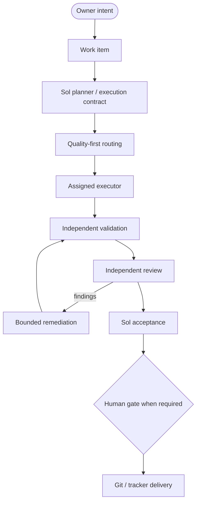
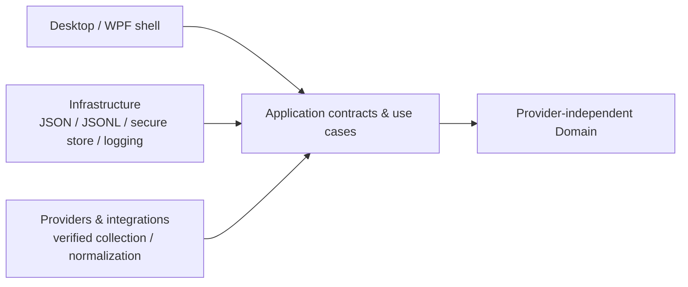

<p align="center">
  
</p>

<h1 align="center">AI_Orchestrator</h1>

<p align="center">
  Intelligent orchestration for projects, AI agents, execution, and quality.
</p>

<p align="center">
  <a href="https://dotnet.microsoft.com/"></a>
  <a href="https://learn.microsoft.com/dotnet/desktop/wpf/"></a>
  <a href="https://www.microsoft.com/windows/"></a>
  <a href="https://learn.microsoft.com/dotnet/csharp/"></a>
</p>

<p align="center">
  
</p>

> APO is a local-first Windows control center for supervising AI-assisted software delivery. It is being built to coordinate the planner, executor, reviewer, Git/GitHub/Azure Repos, Jira/Azure Boards, validation/CI, and owner approval in one place—without replacing the IDE or those platforms.

## FAST V1 closeout status

`FAST V1 CLOSEOUT MODE` is complete. APO-48, APO-51, APO-49, APO-63, APO-50, and APO-33 are
delivered and accepted. APO-33 merged through PR #109, and GitHub Actions CI is active on `main`.
The next planner boundary is the Final V1 Release Audit, which has not started; v1.0.0 has not been
released.

The active implementation gate is **APO-70 (GitHub issue #111)**, V1 desktop product recovery, on
branch `feature/APO-70-v1-desktop-product-recovery` and open as a Draft PR. It is not merged and
not accepted: owner visual acceptance and Sol acceptance both remain outstanding. The V1 release
freeze holds — no tag, release, or deployment has been created.

V1 execution is focused on OpenAI, Claude, and Antigravity Plus. `COPILOT = POST-V1`, and all new
inactive-provider-specific work is deferred until after V1. No new provider integration enters V1
unless it is strictly required for release safety. GitHub remains V1 infrastructure; GitHub Actions
is implemented and active on `main` after APO-33 acceptance.

## What is AI_Orchestrator?

AI_Orchestrator (APO) coordinates the work around software delivery: projects and
repositories, AI capacity, model and agent access, planner-authored execution contracts, bounded
execution, validation, independent review, acceptance, and audit history. The intended experience
lets the owner supervise the handoff between the planner, the bounded executor, the independent
reviewer, source control, work tracking, validation/CI, and the final approval gate.

The product is not an AI chat application and does not replace an IDE, GitHub, Jira, or Azure
DevOps. Its job is to reduce fragile copy/paste handoffs while keeping the owner in charge of
high-risk actions. Quality and risk come before quota savings, and unavailable provider data stays
explicitly unavailable or manual.

## Core capabilities

The product direction brings these capabilities into one supervised workflow:

- :brain: Intelligent, quality-first model and agent routing with quota awareness.
- :bar_chart: AI capacity, subscription, quota, credit, and reset monitoring.
- :file_folder: Project awareness with isolated local workspaces and repository state.
- :robot: AI agent and model registry with truthful connection capabilities.
- :compass: Planner-authored work classification and execution contracts.
- :gear: Bounded, cancellable execution with explicit budgets and stop conditions.
- :test_tube: Validation evidence captured independently from executor claims.
- :mag: Independent review and bounded remediation at configured checkpoints.
- :shield: Human approval gates for high-risk decisions and delivery actions.
- :page_facing_up: Local activity, audit, history, notifications, and reconstructable state.

These are the approved product capabilities, not a claim that every adapter or runtime is already
implemented. See [Current implementation status](#current-implementation-status).

## Orchestration flow

The following is the target product flow. APO-70 now implements the bounded planner-to-executor
slice for an explicitly configured local Codex channel; the full autonomous lifecycle remains
gated by validation, review, acceptance, and delivery authorities.



## Current implementation status

APO is an active foundation, not a finished orchestration product.

| Status | Current evidence |
| --- | --- |
| :white_check_mark: Implemented / validated | .NET 10 WPF foundation and resilient empty/no-provider startup shell |
| :white_check_mark: Implemented / validated | JSON documents and monthly JSONL local persistence with safe-write and recovery behavior |
| :white_check_mark: Implemented / validated | Provider-independent quota, subscription, usage, alert, and refresh contracts |
| :white_check_mark: Implemented / validated | Windows Credential Manager adapter with opaque credential references and focused security tests |
| :white_check_mark: Implemented / validated | Self-contained multi-RID publish configuration for `win-x64`, `win-x86`, and `win-arm64` |
| :white_check_mark: Implemented / validated | Project and orchestration storage foundation (APO-27 merged); stores and contracts for projects, agents, routing policies, runs, and review/audit records |
| :white_check_mark: Implemented / validated | Projects workspace (APO-35 merged); project registry list/detail/editor, search/filter, Active/Paused/Blocked/Archived lifecycle state, and truthful local persistence states; APO-36 fixed DI startup regression |
| :white_check_mark: Implemented / validated | APO-37 read-only local Git repository verification with bounded status evidence, cancellation/project isolation, sanitized remotes, and explicit unavailable states |
| :white_check_mark: Implemented / validated | APO-38..43 control-plane contracts and services: agent/model truth, progressive onboarding, versioned contracts, dependency-aware work graphs, structured handoffs, and durable Smart Continue/recovery state |
| :white_check_mark: Implemented / validated | APO-44..46 bounded execution foundation: explainable quality-first routing, isolated workspaces, and bounded cancellable execution with project/authority/recovery safeguards |
| :white_check_mark: Implemented / validated | APO-68 workspace-preparation hardening: fail-closed approval-index recovery, mutation timeout safety, repository lock identity, and inherited Git-environment hardening |
| :warning: Partial / validated | APO-70 owner-authored Execution workspace, real structured local Codex planner, exact Codex executor adapter, centralized policy resolution, and durable authorities; live provider execution remains fail-closed until an explicit model-configured pair passes isolated smoke |
| :white_check_mark: Implemented / validated | APO-47 tracker-agnostic Jira work-item and dependency synchronization with bounded reads, explicit mutation authority, post-verification, and audit evidence |
| :white_check_mark: Implemented / validated | Official provider capacity adapter surfaces for Codex, Claude, Kimi, GitHub Copilot, and Antigravity, with documented manual/unsupported boundaries |
| :white_check_mark: Implemented / validated | APO-62 provider-independent, read-only remote SCM and CI evidence (GitHub and Azure Repos) |
| :white_check_mark: Delivered / accepted | APO-48 independent validation evidence and evidence-based QA gates; accepted merge `7fe179844ceb056c542067485843bc892ebdefcc` |
| :white_check_mark: Delivered / accepted | APO-51 Review Inbox and bounded remediation loop; accepted merge `ea96beefeec5b2fc2381ad1d4ade39c6c63fc56c` |
| :white_check_mark: Delivered / accepted | APO-49 human approval policy and gates; accepted merge `8d2934bfba844d30365d2c4f3b0b8a53dc2a6fd6` |
| :white_check_mark: Delivered / accepted | APO-63 controlled remote source-control delivery with explicit gates and exact-target evidence |
| :white_check_mark: Delivered / accepted | APO-33 repository-owned GitHub Actions CI and multi-RID packaging; PR #109 merged at `c139ce188b71ebbc8035f0d1046ec15e2419cf4b` |
| :compass: Strategic roadmap | Mission Control, Smart Continue, recovery, dependency-aware work, isolated workspaces, decision ledger, project health, skills, bounded automation, and optional remote approval design |

APO-48 was accepted on product head `caed10d0486994e9235a66ef44ec6137649dd347`, with product
tree `f152699b89b4c1f498c3dbb4357ee07ac00fda77`, merge SHA
`7fe179844ceb056c542067485843bc892ebdefcc`, canonical independent suite **1,136 passed / 0 failed /
0 skipped**, and build **0 warnings / 0 errors**. This is historical APO-48 validation evidence;
at that earlier acceptance point, `GITHUB ACTIONS CI = NONE / NOT CLAIMED`.

Not yet implemented: full consumer capacity surfaces beyond the documented adapter boundaries,
end-to-end autonomous provider execution across the complete planner/review/acceptance/delivery
lifecycle, tracker automation, and the full APO-15 dashboard. APO-70 currently supports only the
bounded local Codex adapter path described above; Claude execution remains unsupported.
The durable control-plane contracts, bounded execution safeguards, and bounded Jira tracker slice in
APO-38 through APO-47 and APO-68 are implemented; APO-62 provider-independent, read-only remote
SCM/CI evidence (GitHub and Azure Repos) is also delivered. APO-48 independent validation evidence
and QA gates, APO-49 human approval policy and gates, and APO-51 Review Inbox and bounded remediation
are delivered and accepted. APO-50 Mission Control and APO-63 controlled remote delivery are also
delivered and accepted. APO-33 repository-owned GitHub Actions CI is implemented and active on
`main`; PR #109 is merged and the post-merge main workflow passed. APO-37 verifies a selected registered local path only
when the owner clicks Verify repository; it does not inspect file contents, use credentials, contact
a remote service, or perform Git writes. APO does not fabricate provider numbers or treat local
state as a substitute for official remote CI evidence.

## Smart Continue and integration boundaries

The Smart Continue contract and durable recovery state are implemented by APO-43, but the owner-facing
command-center experience is not complete. The implemented boundary resolves project/run context,
work, contract version, dependency state, selected roles, repository/tracker evidence, validation,
review, approval, blockers, and next safe action from project-isolated state rather than treating old
chat history as current evidence. It must require fresh Git, tracker, approval, and validation
evidence when a checkpoint is stale or incomplete.

The roadmap keeps source-control responsibilities distinct:

- **Local Git — APO-37:** implemented read-only verification of a configured local repository and
  its bounded worktree evidence. It performs no remote request and no Git write.
- **Remote SCM evidence — APO-62:** delivered provider-independent, read-only evidence from official
  GitHub and Azure Repos integration paths for repository identity, branches/commits, pull requests,
  reviews, checks, and CI/workflow state where exposed.
- **Controlled delivery — APO-63:** planned, separately gated remote write operations bound to exact
  immutable targets, current validation evidence, applicable approval policy, and audit identity.

APO-33 is the delivered repository-owned GitHub Actions build/test/release Story. A model CLI,
missing remote evidence, or a local branch state must not be presented as proof of remote health,
CI success, synchronization, or delivery completion.

## WPF shell preview

The first branded shell is intentionally a foundation surface: it shows the product identity,
local-first state, and truthful future boundaries without inventing provider data or dashboard
metrics.

<p align="center">
  
</p>

## Architecture

The active architecture is a portable C#/.NET 10 WPF application with clean dependency direction,
JSON/JSONL local persistence, and secure external credential storage. No database engine, ORM,
Node.js runtime, embedded browser, or APO-owned cloud backend is required by V1.



The technical solution and namespaces still use the compatibility-sensitive `AIUsageMonitor` name.
That is deliberate: the product identity has changed, but a large technical rename and LocalAppData
migration require their own planner-approved work.

## AI operating model

APO follows a quality- and risk-first operating policy. Capacity can inform routing, but it never
overrides capability, risk, or the required review gate. These are project roles and target policy;
the routing service is implemented, while provider execution and end-to-end autonomous orchestration
remain bounded future work beyond the explicitly configured local Codex slice delivered by APO-70.

| Model | Default role |
| --- | --- |
| **GPT-5.6 Sol High** | Planner, architect, router, quota governor, acceptance and prompt authority (chat only) |
| **GPT-5.6 Luna xHigh** | Primary bounded implementation executor |
| **Claude Sonnet 5 Medium** | Fallback / special-need bounded implementation when explicitly selected by Sol |
| **Claude Sonnet 5 High** | Fallback / special-need difficult bounded implementation when explicitly selected by Sol |
| **GPT-5.6 Luna Max** | Exceptional implementation escalation only |
| **Claude Opus 5** | Independent critical reviewer at meaningful checkpoints |
| **GPT-5.6 Terra Medium/High** | Specialist security, concurrency, and data-integrity assurance |
| **Claude Haiku 4.5** | Disabled from active routing |

OpenAI/Codex and Anthropic/Claude are the active execution providers. GPT-5.6 Sol remains the
planner, architect, router, quota governor, acceptance authority, and prompt authority in chat mode.
Luna xHigh is the normal primary executor. Sonnet is an explicit fallback/special-need option;
Haiku is disabled from active routing; Opus remains independent; and Terra is risk-triggered. The
canonical policy is maintained in
[AI model routing](.ai/AI_MODEL_ROUTING.md) and [AI execution policy](.ai/AI_EXECUTION_POLICY.md).

For FAST V1 resource planning, Antigravity Plus is an auxiliary bounded/mechanical capacity source;
it does not change the canonical OpenAI/Claude orchestration executor policy.

## Security and privacy

- :lock: Windows Credential Manager stores actual credentials outside JSON, JSONL, logs, and source control.
- :key: Application state stores only opaque credential references; raw tokens and passwords are not persisted.
- :no_entry_sign: APO does not extract browser cookies, scrape passwords, or treat a consumer subscription as API entitlement.
- :package: Local-first project state and history remain under per-user application data.
- :scroll: Evidence and audit history are designed to explain routing, validation, review, and approval decisions without storing secrets.
- :shield: High-risk operations stop at explicit human approval gates.

Project isolation, configured exclusions, secret scanning/redaction, least privilege, and visible
destinations are part of the product contract for future integrations.

## Windows compatibility

APO targets Windows 10 version 1809 (build 17763) and Windows 11, with these release RIDs under
consideration:

- `win-x64` - primary development and validation target.
- `win-x86` - configured and compile/publish validated where stated in the evidence.
- `win-arm64` - configured and compile/publish validated where stated; ARM64 hardware execution is not claimed.

The consumer goal is a self-contained Windows application that does not require a separately
installed .NET runtime, SDK, Visual Studio, database engine, Node/npm, embedded browser, or provider
CLI. Claims are limited to the environments and commands actually run.

## Repository structure

```text
AI_Orchestrator/
|-- assets/
|   |-- Logo.png
|   |-- Colors.png
|   |-- runtime/apo-icon.ico
|   `-- readme/apo-flow.svg
|-- docs/
|   |-- BRD.md
|   |-- IMPLEMENTATION_PLAN.md
|   |-- LEGACY_IMPLEMENTATION_MAP.md
|   |-- STRATEGIC_ROADMAP.md
|   |-- SESSION_PROMPTS.md
|   |-- APO-31_PROVIDER_EVIDENCE.md
|   `-- evidence/ (retained acceptance screenshots)
|-- scripts/Validate-PublishOutput.ps1
|-- .github/workflows/ci.yml
|-- src/
|   |-- AIUsageMonitor.Desktop/
|   |   `-- Resources/ (WPF brand dictionaries)
|   |-- AIUsageMonitor.Application/
|   |-- AIUsageMonitor.Domain/
|   |-- AIUsageMonitor.Infrastructure/
|   `-- AIUsageMonitor.Providers/
|-- tests/
|   |-- AIUsageMonitor.Domain.Tests/
|   |-- AIUsageMonitor.Connection.Tests/
|   |-- AIUsageMonitor.Provider.Tests/
|   |-- AIUsageMonitor.Desktop.Tests/
|   `-- AIUsageMonitor.Infrastructure.Tests/
|-- .ai/CURRENT_STATE.md
|-- AGENTS.md
|-- TASK.md
|-- Directory.Build.props
`-- AIUsageMonitor.sln
```

## Build and test

The commands below use the compatibility-preserved solution name:

```powershell
dotnet restore AIUsageMonitor.sln
dotnet build AIUsageMonitor.sln
dotnet test AIUsageMonitor.sln
```

The desktop test project builds for the `x64` platform. Running it on its own, rather than through
the solution, needs that platform stated explicitly or the run will silently execute a stale
`AnyCPU` assembly:

```powershell
dotnet test tests/AIUsageMonitor.Desktop.Tests/AIUsageMonitor.Desktop.Tests.csproj `
  -p:Platform=x64
```

For a self-contained Windows artifact, use one of the desktop publish profiles:

```powershell
dotnet publish src/AIUsageMonitor.Desktop/AIUsageMonitor.Desktop.csproj `
  -p:PublishProfile=win-x64
```

For an owner-visible local run, use the canonical fresh-run script:

```powershell
.\scripts\Run-FreshDesktop.ps1
```

It recreates `artifacts/local-run/win-x64`, publishes the current working tree in Release,
validates the new self-contained executable, reports its Git state and SHA-256, and leaves that
exact executable running. Use `-SmokeTest` for bounded startup verification and cleanup of only
the process launched by the script. Existing binaries are not current-run evidence.

The matching profiles for `win-x86` and `win-arm64` are in
`src/AIUsageMonitor.Desktop/Properties/PublishProfiles/`. Build, test, and publish output should
be treated as evidence only after the command completes successfully on the current checkout.

### Continuous integration

GitHub Actions runs on pull requests targeting `main`, pushes to `main`, and manual dispatches.
The `AI_Orchestrator CI` workflow restores and builds the solution in Release, runs the canonical
test suite with TRX results, and publishes independently validated artifacts for every runtime
identifier declared by the desktop project: `win-x86`, `win-x64`, and `win-arm64`. Downloadable
artifacts are named `AI_Orchestrator-Release-<rid>`; the publish profiles remain the source of
truth for their self-contained, single-file settings. APO-33 was Sol-accepted and merged through
PR #109 at `c139ce188b71ebbc8035f0d1046ec15e2419cf4b`. The accepted PR run `34478101086` and the
post-merge `main` run `34486056095` passed; the canonical suite reported 1,249 passed / 0 failed /
0 skipped.

That is the evidence for `main`. The unmerged APO-70 branch has since grown the suite to 1,309
passed / 0 failed / 0 skipped with a Release build of 0 warnings / 0 errors; that work is neither
accepted nor on `main`, and its exact-head run is recorded on PR #112.

## Documentation

- [Business Requirements Document](docs/BRD.md)
- [Implementation Plan](docs/IMPLEMENTATION_PLAN.md)
- [Strategic Orchestration Roadmap](docs/STRATEGIC_ROADMAP.md)
- [Legacy Implementation Map](docs/LEGACY_IMPLEMENTATION_MAP.md)
- [Session Prompt Library](docs/SESSION_PROMPTS.md)
- [Execution Contract and Sol Checkpoint](AGENTS.md)
- [Current State and Validation Handoff](.ai/CURRENT_STATE.md)
- [Current Task Contract](TASK.md)

## Roadmap

The roadmap follows the approved APO Epics and the strategic P0/P1/P2/P3 backlog in Jira. Delivered
slices are identified explicitly; the remaining entries are planned capability boundaries, not
shipped runtime claims:

1. **Delivered P0 control plane — APO-38..46 and APO-68:** agent/model truth, progressive onboarding, contracts, dependency graphs, handoffs, durable recovery, quality-first routing, bounded execution, isolated workspaces, and workspace-preparation hardening.
2. **P0 tracker/evidence inputs — APO-47 and APO-62 delivered:** Jira/Azure Boards awareness (APO-47) and read-only remote SCM/CI evidence (APO-62) are both delivered.
3. **P0 evidence, approval, and delivery — APO-48, APO-49, and APO-63 delivered:** independent QA evidence, gates, human approval policy, and controlled remote delivery are accepted.
4. **P0 Mission Control — APO-50 delivered:** one evidence-backed command-center read model and
   surface, accepted.
5. **P1 acceleration — APO-51..56:** APO-51 Review Inbox is delivered and accepted; later P1 capabilities remain deferred until separately authorized.
6. **P2 controlled expansion — APO-57..58:** bounded background housekeeping and optional remote approval security design.
7. **P3 remaining/planned hardening — APO-59..61 (Jira: To Do):** APO-37 evidence bounds, verification UX truthfulness, and explicit real-Git availability semantics.

APO-33 remains the existing CI/release Story under APO-17. Existing APO-27, APO-35, APO-36, and
APO-37 work is implemented evidence, not a claim that the full orchestration runtime exists.

Each Story is scoped by a Sol-approved `TASK.md` contract. A completed foundation does not
authorize the next Story automatically.

## Contributing and governance

APO work is evidence-led and branch-scoped. A contributor or executor should:

1. read `AGENTS.md`, the BRD, current state, implementation plan, and the active `TASK.md`;
2. work only within the assigned canonical GitHub APO Issue and preserve unrelated owner changes;
3. validate the relevant build, tests, security, compatibility, and documentation surfaces;
4. update `.ai/CURRENT_STATE.md` with factual evidence and limitations; and
5. commit and push the branch, open or update one Draft PR, and stop at the planner boundary so
   GPT-5.6 Sol can accept, reject, or issue the next contract.

The owner remains the authority for protected-branch merges, high-risk actions, and material
architecture or requirement changes. A Draft PR is not a merge or acceptance. `TASK.md` is the
current planner boundary/execution contract when Sol has populated it; it is not a historical log.

## Product identity mapping

| Surface | APO identity | Compatibility decision |
| --- | --- | --- |
| User-facing product, shell, README, and metadata | **AI_Orchestrator (APO)** | Updated in the branding Story |
| Approved visual assets | `assets/Logo.png`, `assets/Colors.png` | Original bytes preserved |
| Runtime icon | `assets/runtime/apo-icon.ico` | Derived compact symbol for Windows surfaces |
| Solution, project, namespace, and test identifiers | `AIUsageMonitor.*` | Preserved for controlled future migration |
| Local persistence root | `%LOCALAPPDATA%\\AIUsageMonitor` | Preserved; no silent data migration |

## License

No license file is currently committed. Until the owner adds a license, reuse and redistribution
rights should not be inferred from this README.

<p align="center">
  
</p>

<p align="center"><sub>AI_Orchestrator - APO</sub></p>
